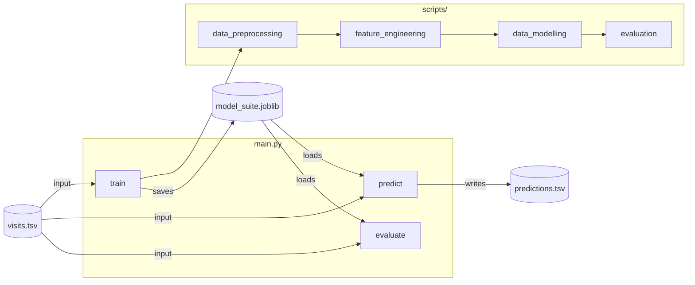
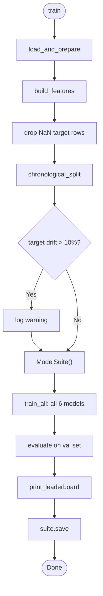
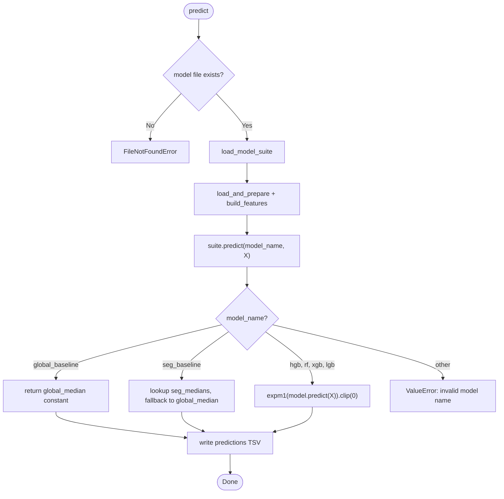
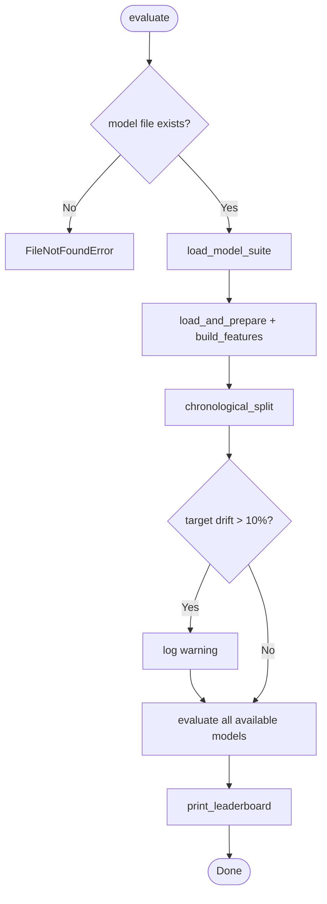
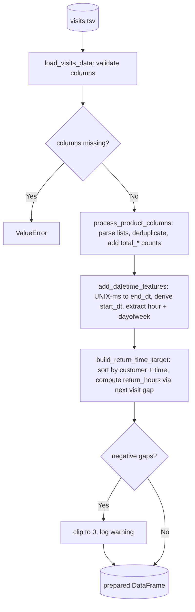
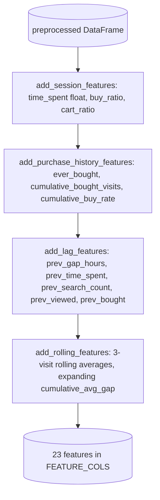
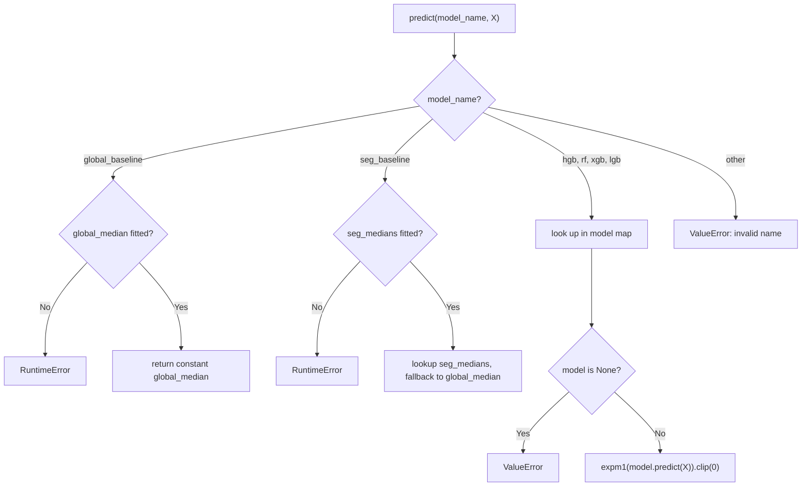
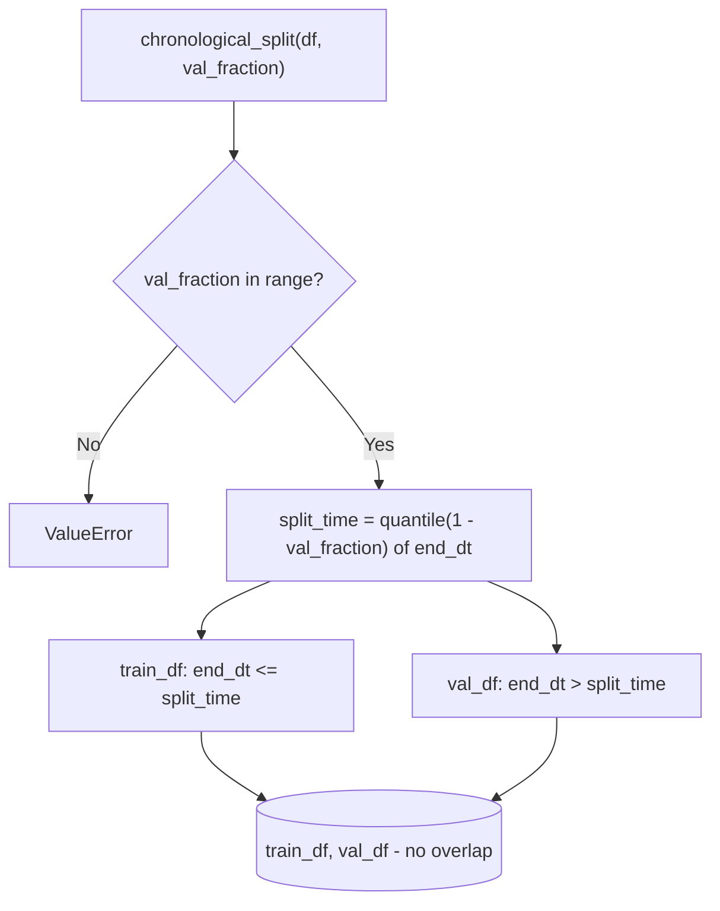
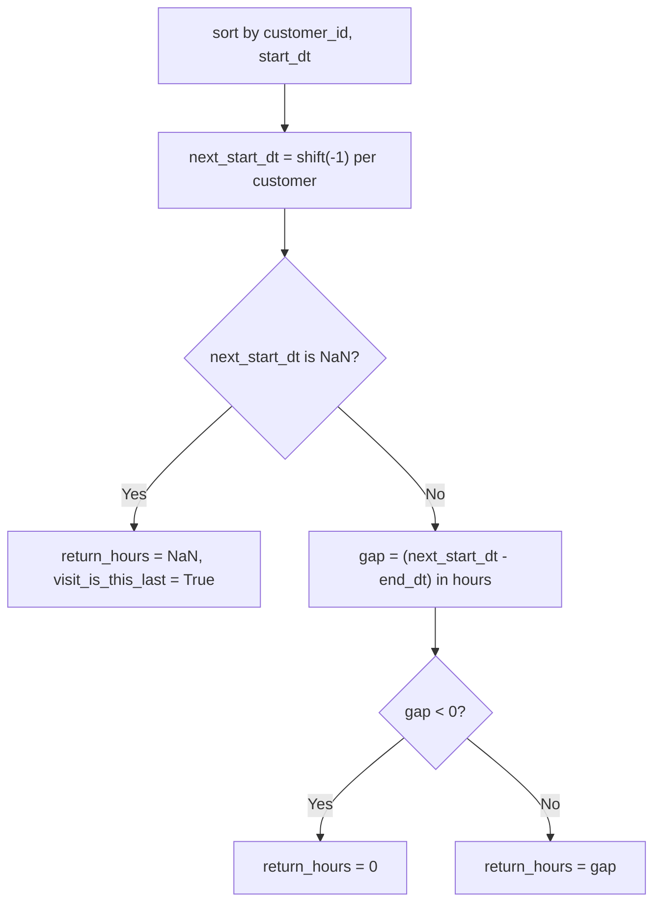

# Pipeline Diagrams

Mermaid diagrams covering the CLI commands, data flow, and decision logic.

---

## 1. System Architecture

---

## 2. `train` Command

---

## 3. `predict` Command

---

## 4. `evaluate` Command

---

## 5. Preprocessing Pipeline

---

## 6. Feature Engineering Pipeline

All features use `shift(1)` within customer groups - no future leakage.

---

## 7. `ModelSuite.predict()` Routing

---

## 8. Chronological Split

No shuffling - the val set is always in the future relative to train.

---

## 9. Target Construction (`return_hours`)

