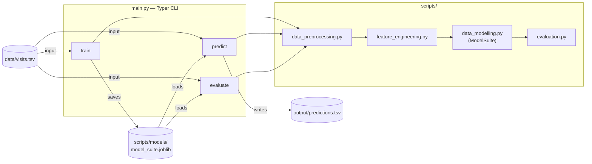
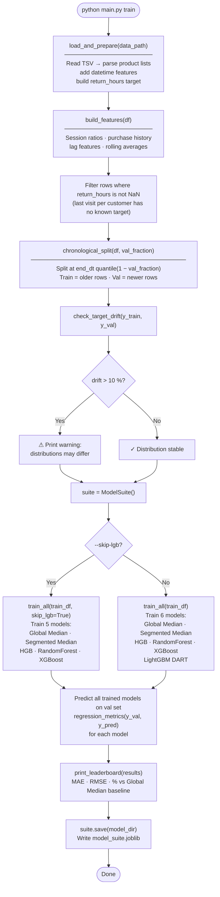
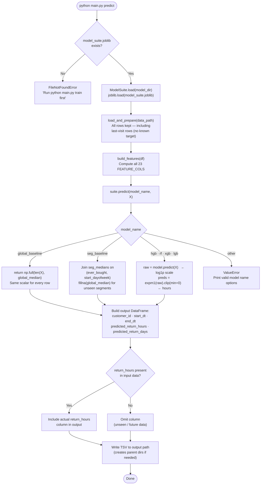
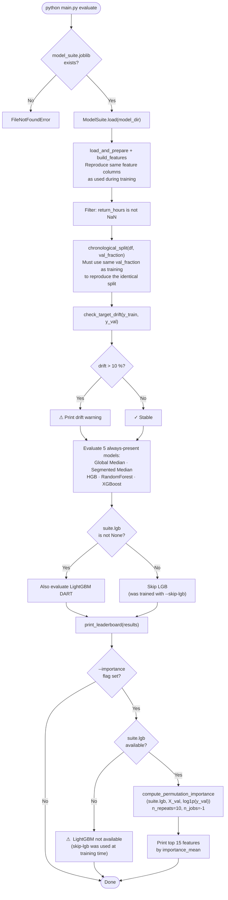
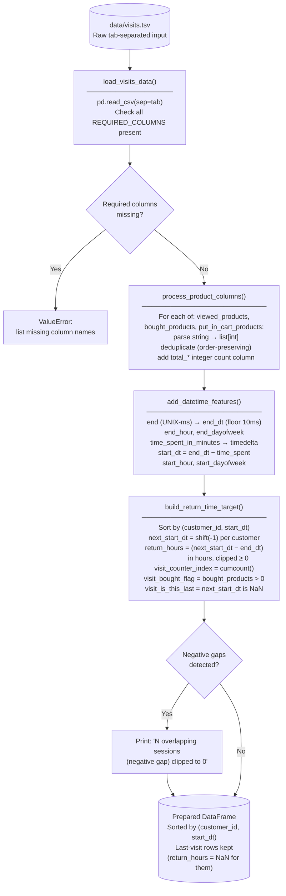
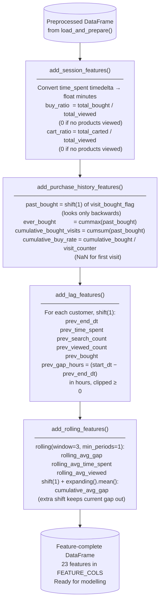
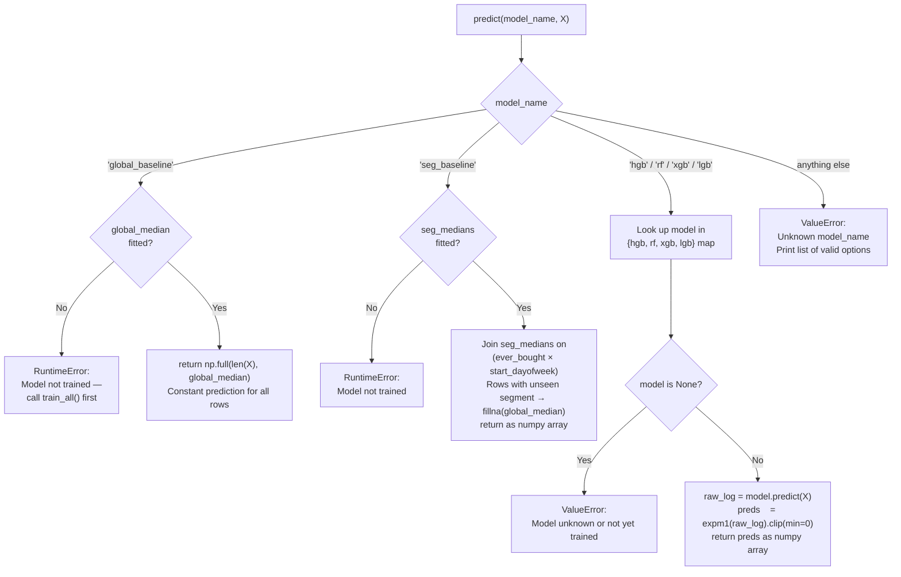
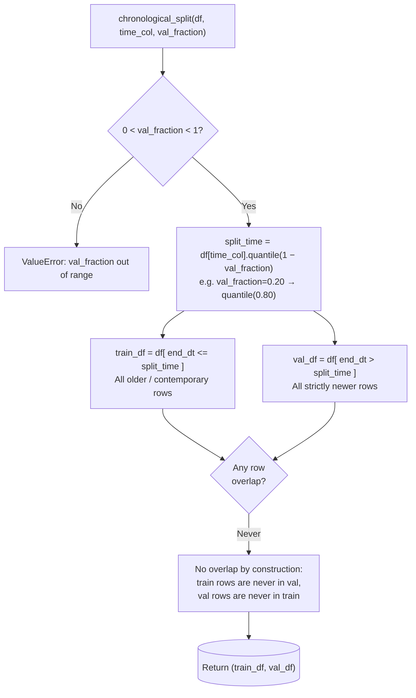
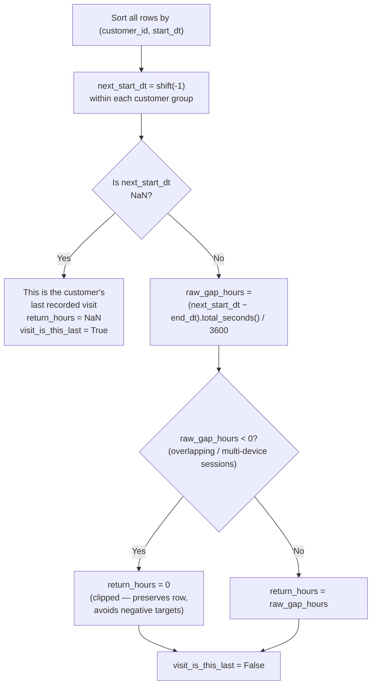

# Pipeline Diagrams

Decision logic and data-flow visualisations for the CLI tool and all supporting
modules. Every diagram is self-contained and can be rendered in any Mermaid-aware
viewer (VS Code with the Markdown Preview Mermaid Support extension, GitHub, etc.).

---

## 1. System Architecture

High-level view of how the three CLI commands relate to the script modules,
input data, and persisted artefacts.

---

## 2. `train` Command — Decision Flow

---

## 3. `predict` Command — Decision Flow

---

## 4. `evaluate` Command — Decision Flow

---

## 5. Preprocessing Pipeline (`data_preprocessing.py`)

---

## 6. Feature Engineering Pipeline (`feature_engineering.py`)

All steps operate within each customer group to prevent cross-customer leakage.
All lag/history features apply `shift(1)` so a visit cannot see its own outcome.

---

## 7. `ModelSuite.predict()` Routing Logic

---

## 8. Chronological Split Logic

Random shuffling would allow future data to leak into the training set.
The quantile-based split below guarantees the val set is strictly in the future
relative to the training set.

---

## 9. Target Construction Detail

How `return_hours` is built for each row within `build_return_time_target()`.

